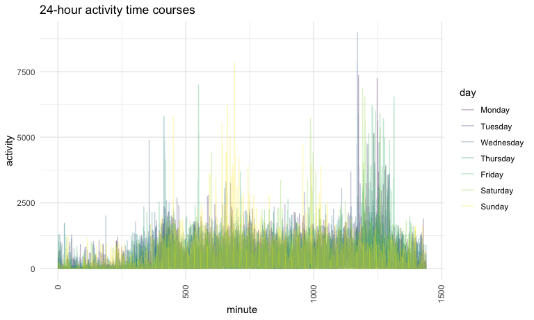

P8105 HW3
================
Yijin Serena Wang
2022-10-12

``` r
library(tidyverse)
library(readxl)
library(janitor)
library(lubridate)
library(ggplot2)
library(p8105.datasets)
library(patchwork)
data("ny_noaa")
data("instacart")
```

``` r
knitr::opts_chunk$set(
  fig.width = 6,
  fig.asp = .6,
  out.width = "90%"
)

theme_set(theme_minimal() + theme(legend.position = "bottom"))

options(
  ggplot2.continuous.colour = "viridis",
  ggplot2.continuous.fill = "viridis"
)

scale_colour_discrete = scale_colour_viridis_d
scale_fill_discrete = scale_fill_viridis_d
```

# Problem 1

The `instacart` data set contains users’ online purchasing information
in 2017. It has 1384617 rows and 15 columns. The dataset is organized by
`order_id` and `product_id` of each user. It also has detailed
information for each order such as `order_dow`,
`days_since_prior_order`.

illustrative examples

``` r
aisle_product_count <- instacart %>% 
  select(aisle, product_id) %>%
  group_by(aisle) %>%
  summarize(product_count = n()) %>%
  arrange(desc(product_count))

head(aisle_product_count)
```

    ## # A tibble: 6 × 2
    ##   aisle                         product_count
    ##   <chr>                                 <int>
    ## 1 fresh vegetables                     150609
    ## 2 fresh fruits                         150473
    ## 3 packaged vegetables fruits            78493
    ## 4 yogurt                                55240
    ## 5 packaged cheese                       41699
    ## 6 water seltzer sparkling water         36617

There are 134 aisles. Fresh vegetables has the most items ordered.

``` r
aisle_product_count %>%
  filter(product_count > 10000) %>%
  ggplot(aes(x = reorder(aisle, -product_count), y = product_count)) +
  geom_bar(stat = "identity") +
  theme(axis.text.x = element_text(angle = 60, hjust=1)) + 
  labs(x = "Aisle", y = "Number of items ordered")
```


``` r
instacart %>%
  filter(aisle %in% c("baking ingredients", "dog food care", "packaged vegetables fruits")) %>% 
  select(aisle, product_name) %>%
  group_by(aisle,product_name) %>%
  summarise(product_count = n()) %>%
  top_n(3,product_count) %>%
  ungroup() %>%
  knitr::kable(digits = 1)
```

    ## `summarise()` has grouped output by 'aisle'. You can override using the
    ## `.groups` argument.

| aisle                      | product_name                                  | product_count |
|:---------------------------|:----------------------------------------------|--------------:|
| baking ingredients         | Cane Sugar                                    |           336 |
| baking ingredients         | Light Brown Sugar                             |           499 |
| baking ingredients         | Pure Baking Soda                              |           387 |
| dog food care              | Organix Chicken & Brown Rice Recipe           |            28 |
| dog food care              | Small Dog Biscuits                            |            26 |
| dog food care              | Snack Sticks Chicken & Rice Recipe Dog Treats |            30 |
| packaged vegetables fruits | Organic Baby Spinach                          |          9784 |
| packaged vegetables fruits | Organic Blueberries                           |          4966 |
| packaged vegetables fruits | Organic Raspberries                           |          5546 |

``` r
instacart %>%
  filter(product_name %in% c("Pink Lady Apples", "Coffee Ice Cream"))  %>%
  select(order_hour_of_day, order_dow, product_name) %>%
  group_by(product_name, order_dow) %>%
  summarise(mean_order_hour = mean(order_hour_of_day)) %>%
  ungroup()  %>%
  pivot_wider(names_from = product_name,
              values_from = mean_order_hour) %>%
  knitr::kable(digits = 1)
```

    ## `summarise()` has grouped output by 'product_name'. You can override using the
    ## `.groups` argument.

| order_dow | Coffee Ice Cream | Pink Lady Apples |
|----------:|-----------------:|-----------------:|
|         0 |             13.8 |             13.4 |
|         1 |             14.3 |             11.4 |
|         2 |             15.4 |             11.7 |
|         3 |             15.3 |             14.2 |
|         4 |             15.2 |             11.6 |
|         5 |             12.3 |             12.8 |
|         6 |             13.8 |             11.9 |

# Problem 2

``` r
# load and clean accelerometers data set
accel_data <- read_csv("./Data/accel_data.csv") %>%
  # pivot activity.* columns longer
  # minute column has the minute number associated with activity
  # activity column has corresponding values to the original activity.* columns
  pivot_longer(
    cols = starts_with("activity"),
    names_to = "minute",
    names_prefix = "activity.",
    values_to ="activity"
  ) %>%
  # clean names
  clean_names() %>%
  # create a column to denote if the day value is weekday or weekend
  mutate(is_weekday = ifelse(
    day %in% c("Saturday", "Sunday"), 
    FALSE, 
    TRUE))
```

    ## Rows: 35 Columns: 1443
    ## ── Column specification ────────────────────────────────────────────────────────
    ## Delimiter: ","
    ## chr    (1): day
    ## dbl (1442): week, day_id, activity.1, activity.2, activity.3, activity.4, ac...
    ## 
    ## ℹ Use `spec()` to retrieve the full column specification for this data.
    ## ℹ Specify the column types or set `show_col_types = FALSE` to quiet this message.

The resulting data set has 50400 rows and 6 columns. It contains week,
day_id, day, minute, activity, is_weekday columns. It contains 5 weeks
of data of an accelerometer worn by a patient.

``` r
accel_data %>% 
  group_by(day_id) %>%
  summarise(total_activity = sum(activity))
```

    ## # A tibble: 35 × 2
    ##    day_id total_activity
    ##     <dbl>          <dbl>
    ##  1      1        480543.
    ##  2      2         78828.
    ##  3      3        376254 
    ##  4      4        631105 
    ##  5      5        355924.
    ##  6      6        307094.
    ##  7      7        340115.
    ##  8      8        568839 
    ##  9      9        295431 
    ## 10     10        607175 
    ## # … with 25 more rows

The trends are not apparent.

``` r
ggplot(data = accel_data, 
       aes(x = minute, y = activity, color = day)) +
  geom_point(alpha = .5) +
  theme(axis.text.x = element_text(angle = 90, vjust = 0.5, hjust=1))
```



# Problem 3

The `ny_noaa` data set has 2595176 rows and 7 columns. It contains
precipitation, snowfall, depth of snow and min and max temperatures of
each documented NY state weather stations from 1981-01-01 and
2010-12-31. Just by looking at the data, there are a lot of cells with
NAs. Sometimes, there is no information about precipitation, snowfall,
depth of snow and min and max temperatures for a particular station and
a date. min and max temperatures are missing for a lot of stations and
dates.

``` r
clean_ny_noaa <- ny_noaa %>%
  # clean names
  clean_names() %>%
  # break date column into month, day, year columns
  separate(col = date, 
           sep = "-",
           into = c("year", "month", "day")) %>%
  # convert precipitation to mm, temperatures to degree Celcius 
  # and snow depth to cm
  mutate(prcp = prcp/10,
         snwd = snwd/10,
         tmax = as.numeric(tmax)/10,
         tmin = as.numeric(tmin)/10)
```

``` r
clean_ny_noaa %>%
  count(snow, name = "count") %>%
  top_n(1, count)
```

    ## # A tibble: 1 × 2
    ##    snow   count
    ##   <int>   <int>
    ## 1     0 2008508

The most commonly observed value is 0. It might be because the actual
data is documented in the `snwd` column.

``` r
clean_ny_noaa  %>%
  filter(month %in% c("07","01")) %>%
  group_by(year, month) %>%
  # calculate average of max temperatures for observations in each month, year
  mutate(avg_tmax = mean(tmax, na.rm = TRUE)) %>%
  # make plot
  ggplot(aes(x = year, y = avg_tmax)) +
  geom_point(alpha = .5) +
  # create facets based on month
  facet_wrap(. ~ month) + 
  theme(axis.text.x = element_text(angle = 90, vjust = 0.5, hjust=1)) +
  labs(title = "Average Max Temperature")
```


It seems like the average temperatures in July are all higher than those
in January across these years. Average temperatures in July seem to have
a lower variance than those in January. There is no significant
outliers.

``` r
tmax_tmin_p <- clean_ny_noaa %>%
  pivot_longer(cols = c("tmax", "tmin"), 
               names_to = "temp_type", 
               values_to = "temp_value")  %>%
  ggplot(aes(x = temp_type, y = temp_value)) +
  geom_boxplot() + 
  labs(title = "Max Temperature vs. Min Temperature")
  

snowfall_p <- clean_ny_noaa %>%
  filter(snow < 100 & snow > 0) %>%
  ggplot(aes(x = snow, fill = year)) + 
  geom_density(alpha = .3) +
  theme(legend.position = "right") +
  labs(title = "Distribution of snowfall", x = "snowfall")

tmax_tmin_p/snowfall_p
```

    ## Warning: Removed 2268778 rows containing non-finite values (stat_boxplot).


